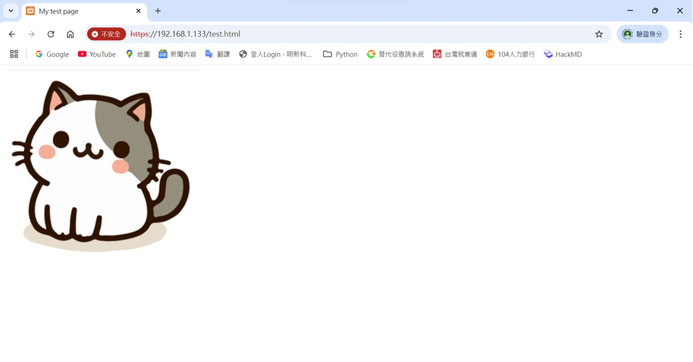

# HackMD期中作業筆記

---

**HackMD**筆記以<font color=#FF3333>Markdown</font>語法為基礎，追求==簡潔的線上協作筆記==。創始者是由*北科大資工系吳承翰*於研究所作業時所啟發並開發，其中<font color=#FF7744>MD</font>指的是==採用**MarkDown**語法撰寫==。

## 寫作方式

**HackMD**</font>筆記以<font color=#008800>HackMD</font>為*工程師文件而生的文件協作平台*，</font>筆記<font color=#DDAA00>主推多人協作服務</font>。編輯器本身可以作為簡單的筆記軟體來==寫日記、寫稿、寫文件==，並用標籤（tag）進行分類與管理。支援其他程式碼跟語法，例如 **YAML、MathJax、Uml diagrams**，同時也提供「==簡報模式」跟「書籍模式==」，讓使用者擁有更多的發揮創作空間。

### 清單

- 無序清單1
- 無序清單2
  - 無序清單2.1
- 無序清單3
   - 無序清單3.1
   - 無序清單3.2
     - 無序清單3.2.1
   - 無序清單4
   
1. 有序清單1
2. 有序清單2
3. 有序清單3
   1. 有序清單3.1
   2. 有序清單3.2

### 隨堂作業連結

1\. [我的第一個HackMD筆記](https://hackmd.io/f-AKNtwcT2mHpey3HVzgdg)
2\. [色塊強調](https://hackmd.io/Q1nxrQH1Q9msT7MZKndhfw)
3\. [表格練習](https://hackmd.io/aUWHNDPwS6yuxi-ir0Xptg)
4\. [程式碼](https://hackmd.io/1IAA-LZwRaGeyHVn9aZ3Hg)

### 色塊強調

:::success

immust1A

:::

:::info

RERERERERER

:::

:::warning

INFOFOOFOFOFF

:::

:::danger

bbbbbbbbbbbbbb

:::

### emoji符號

:relieved: :satisfied: :stuck_out_tongue_winking_eye: :anguished:
:man_in_tuxedo: :mountain: :man_in_tuxedo: :ocean:
:horse: :horse: :tiger: :tiger:
:womans_clothes: :rice: :older_man: :older_woman:
:turtle: :hearts: :four: :rocket:

### 圖片


### 影片



### 表格

| apple   | orange |  peach |
| ------- | ------ |  ----- |
| yellow  | purple |  green |
| ------  | ------ |  ----- |
| watch   | look   |  taste |
| chinese | manage | escate |
| aaaaaaa | bbbbbb | cccccc |
| ddddddd | eeeeee | ffffff |


### 程式碼

```htmlembedded=1
<!DOCTYPE html>
<html>
 <head>
  <meta charset="utf-8">
  <title>My test page</title>
 </head>
  <body>
   
  </body>
</html>